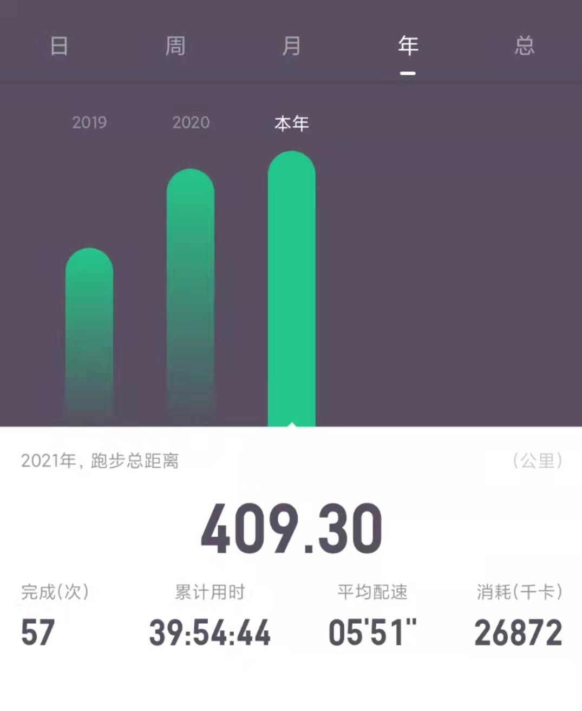
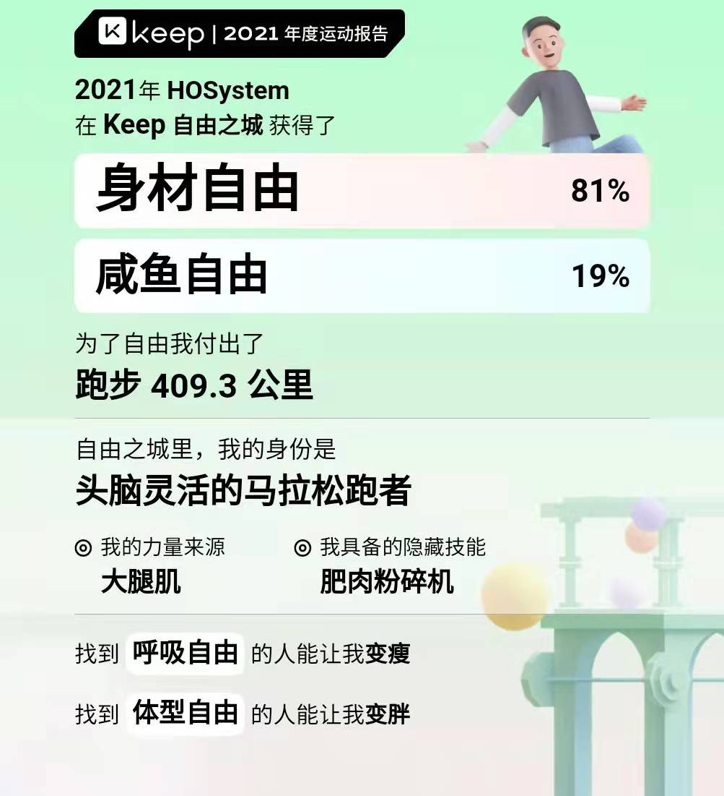
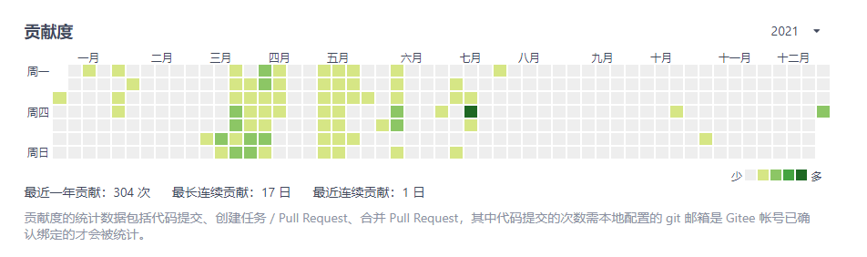

#### 2021年 计划

- [x] 1、学习更多的知识:grin:
- [x] 2、学习408的知识，至少能熟悉计算机组成原理、操作系统、计算机网络、算法这几个的联系，区别等。:grin:
- [ ] 3、整理408的知识到博客上。  （一篇未整理）:disappointed_relieved:
- [ ] 4、读技术书籍至少阅读12本。（应该有8本左右）
- [x] 5、保持阅读的兴趣 :grin:
- [ ] 6、保持坚持每个月运动，至少不少于10次的运动次数。(平均一个月5次) :open_mouth:
- [x] 7、找到一份自己满意的工作 :grin:

2021马上就成为过去，回望2021年有太多的不舍。但不舍的同时，我们也要往前看，要好好规划规划2022年的事情。

#### 个人总结

- 1、这一年学习了不少的知识，看了很多技术文章；也有不少是收藏未看的文章(收藏相当于看完:satisfied:)。
- 2、cnblogs博客园今年一直处于半放弃状态，差不多一个月才发1篇博客。
- 3、gitee，有坚持的过程，有放弃又捡起来的过程，总的来说这一年push的很少。

- 4、利用空余时间学习jenkins的自动化部署，能够单独配合github、gitee进行自动化部署，对jenkins进行测试后在项目中应用。
- 5、利用空余时间学习文件系统的搭建并进行测试使用，然后再项目中应用。
- 6、这一年也接触了一些安全相关的知识，如`OWASP top10`等知识。`dvwa靶场`、`sqli-lib靶场`及实验等过程。
- 7、使用Java进行简单的爬虫。
- 8、其它比较零散，就不一一列举了。

#### 2022年 计划

- 1、完善爬虫项目；
- 2、系统化学习安全相关知识；
- 3、学习设计模式和算法；
- 4、系统化的学习运维的知识，并能够达到从中查找出服务器的瓶颈并给出解决方案；
- 5、学习docker和kubernetes，争取达到能够灵活应用到项目中；
- 6、阅读Spring、dubbo、netty、Spring Boot等重要框架的源码，；
- 7、leetcode算法题目争取1天1道题；
- 8、搭建一个属于自己的脚手架；
- 9、争取2022年平均每2周发一篇博客；
- 10、争取2022的gitee和github能够亮起一片；
- 11、保持阅读书籍的习惯(争取读10本书)
- 12、争取阅读技术书籍保持1个月1本的进度；
- 13、保持热爱、保持运动 锻炼身体；

