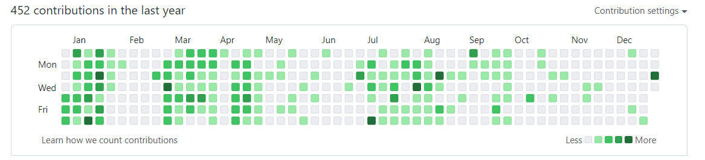
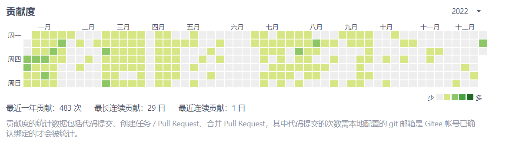

#### 2022年 计划

- [x] 1、完善爬虫项目；:grin:

- [x] 2、系统化学习安全相关知识；(基本完成):grin:

- [ ] 3、学习设计模式和算法；:disappointed_relieved:
- [x] 4、系统化的学习运维的知识，并能够达到从中查找出服务器的瓶颈并给出解决方案；:grin:
- [x] 5、学习docker和kubernetes，争取达到能够灵活应用到项目中；:grin:
- [ ] 6、阅读Spring、dubbo、netty、Spring Boot等重要框架的源码；:disappointed_relieved:
- [ ] 7、leetcode算法题目争取1天1道题；:disappointed_relieved:
- [x] 8、搭建一个属于自己的脚手架；:grin:
- [x] 9、争取2022年平均每2周发一篇博客；
- [x] 10、争取2022的gitee和github能够亮起一片；
- [ ] 11、保持阅读书籍的习惯(争取读10本书) :disappointed_relieved:
- [ ] 12、争取阅读技术书籍保持1个月1本的进度；(4本书)
- [x] 13、保持热爱、保持运动 锻炼身体；:grin:

#### 个人总结

- 1、这一年也算完成了年初立下的部分Flag，但是相比于年初定下的目标还相差甚远；
- 2、cnblogs博客园也勉强能实现一个月一篇博客，至少没有荒废写博客分享技术的习惯；

- 3、Gitee、Github能保持平均一天一push状态，至少能实现了年初定下的亮起一片的计划了；

- 4、学习 Docker、Kubernetes 容器及编排相关技术，能够通过 Docker 实现前后端项目的部署；
- 5、完善了爬虫的文档，使用 Python、Java 方式的爬虫方式都完善了；
- 6、今年编写的技术文档也有了较大的改进，不论从文档的质量、体量上来说是达到目前的文档预期要求的，目前完成的文档有 Docker、Bash Shell、Spider爬虫等文档；
- 7、web安全也算有了一个比较完整的学习，从信息收集、Web攻防、服务攻防、红蓝对抗、内网渗透等方面都有触及，但是内容的深度和广度并未达到个人预期目标，争取23年能够接着对Web安全进行技术的深耕；
- 8、源码、算法、设计模式这三个计划是完成度最差的，几乎没有做源码、算法等方面的知识储备，争取明年源码的知识储备能够达到预设的计划，如，Spring、Dubbo、Netty、Spring Boot等源码；
- 9、继续完善个人的脚手架，不仅仅从功能的集成上下手，更多的要从实用性、安全性方面进行完善；
- 10、运维的技能水平也较21年提升了不少，目前还达不到个人的运维技术要求，争取23年继续深入研习运维技术，Bash Shell脚本、自动化部署脚本也要继续完善；
- 12、22年的运动量达标、技术书籍阅读量未达标（完成7本）、其它书籍阅读量未达标（完成1本）；

#### 2023年 计划

- 1、阅读Spring、dubbo、netty、Spring Boot等重要框架的源码；
- 2、学习设计模式和算法，并能够应用到项目代码中；
- 3、扩大安全的知识范围，重心从 Web 安全转向工控（ICS）安全、容器/云原生安全、API安全等其它安全方向；
- 4、对目前存在的Web安全、工控安全、原生云安全靶场进行集成并通过 Github 开源，完成靶场从搭建到运行完整部署文档；
- 5、继续完善个人脚手架，从功能的集成度、实用性、安全性方面进行完善；
- 6、通过 Gitee、Github 开源Web安全、自动化部署、Bash Shell脚本运维等相关文档、工具；
- 7、Docker、Kubernetes容器技术继续深耕，运维技能能够更上一层楼；
- 8、保持阅读书籍的习惯(争取读10本书) ；
- 9、争取阅读技术书籍保持1个月1本的进度；
- 10、保持热爱、保持运动；